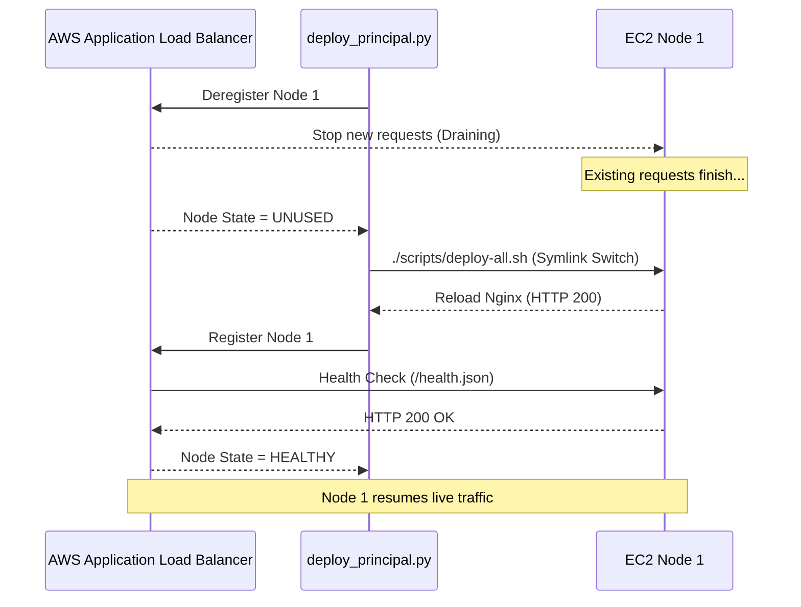
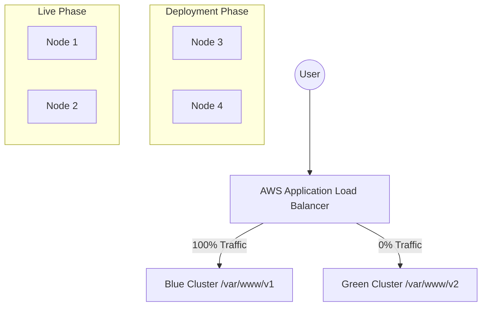
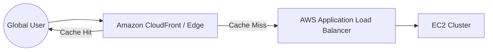

# Principal Architecture: High-Availability & Zero-Risk Rollouts

This document outlines the elite architecture for MakeMyStay's frontend, transitioning from node-level atomic updates to **Request-Level Zero-Downtime** and **Blue-Green** deployment strategies.

## 🏗️ Request-Level Zero-Downtime (Draining)

Current deployment uses **Target Group Draining**. This ensures that before any node is updated, it is gracefully deregistered from the Load Balancer, allowing active requests to finish before the code is swapped.

---

## 🔵🟢 Blue-Green Deployment Strategy

To achieve 100% risk elimination, we move to a side-by-side cluster architecture.

### Rollout Flow:
1.  **Stage Green**: Deploy version `v2` to a separate set of nodes (or separate Target Group).
2.  **Internal Validation**: Verify Green cluster health via private DNS.
3.  **Switch**: Change the ALB Listener Rule to point traffic to the **Green Target Group**.
4.  **Standby**: Keep the Blue cluster alive for 1 hour for **Instant Rollback**.

---

## 🐤 Canary Releases (Traffic Splitting)

For higher confidence, we shift traffic in segments.

| Phase | Blue (v1) | Green (v2) | Purpose |
| :--- | :--- | :--- | :--- |
| **P1** | 95% | 5% | Verify error rates on real traffic |
| **P2** | 75% | 25% | Performance checking (Latency/CPU) |
| **P3** | 0% | 100% | Full migration |

---

## 🌍 Global Performance (CDN Integration)

To offload the EC2 cluster and provide <100ms latency globally, we utilize **Amazon CloudFront**.

> [!TIP]
> **Staff Insight**: Adding an `Invalidation` step to the CI/CD pipeline ensures that `/index.html` is purged from CloudFront immediately after a deployment, forcing users to load the new version.
